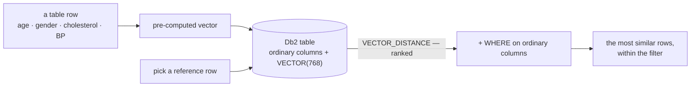

# Tabular search

[← Db2 AI Cookbook](../README.md)

> Similarity search over the rows of an ordinary table. Give Db2 a vector per row, and
> `VECTOR_DISTANCE` will rank rows by closeness — with normal SQL predicates applied in the same
> statement.

This is the simplest thing you can do with a `VECTOR` column, and the foundation the other
modules build on. The embedding here stands for a **whole row** — a patient record — rather than
a chunk of a document, and the vectors are pre-computed, so nothing distracts from the Db2 side.

The point is the last two steps happening **together**. A dedicated vector store returns nearest
neighbours; answering *"similar to this row, but only where age is 35–40"* then needs a second
system and glue code. Keeping the vector in the row makes it one query.

## Recipes

| Recipe | Stack | What it shows |
|---|---|---|
| [pure-sql](pure-sql/) | `db2` CLP only — no Python, no framework | `VECTOR`, `VECTOR_DISTANCE`, `VECTOR_SERIALIZE`, `VECTOR_DIMENSION_COUNT` across seven `.sql` files, over a 20-row patient table. Vectors are pre-computed |
| [python-watsonx](python-watsonx/) | Jupyter + watsonx.ai embedding API | Where the vectors come from: turn each row into a sentence, embed it with `multilingual-e5-large` (1024-dim), store it in Db2, then add `VECTOR_NORM` to the toolkit |

The two are halves of one story — the first queries vectors, the second produces them. They build
the same `PATIENTS` table at **different dimensions** (768 vs 1024), so they cannot share it; run
the second against its own database if you want to keep the first working.

## Prerequisites

Db2 **12.1.2 or later** — that is where the `VECTOR` type lands — and a database to run against.
[pure-sql](pure-sql/) needs nothing else: no Python, no virtualenv, no models, and on Db2 12.1's
`SAMPLE` database the demo table already exists with its embeddings, so it runs with zero setup.
[python-watsonx](python-watsonx/) additionally needs Python 3.12 and a watsonx.ai API key, since
it calls the hosted embedding API.

## Where to go next

- [02-multimodal-embedding](../02-multimodal-embedding/) — produce the vectors yourself, from text and images
- [03-hybrid-search](../03-hybrid-search/) — combine vector ranking with keyword search
- [04-rag](../04-rag/) — the same `VECTOR_DISTANCE` retrieval, over document chunks, feeding a language model
