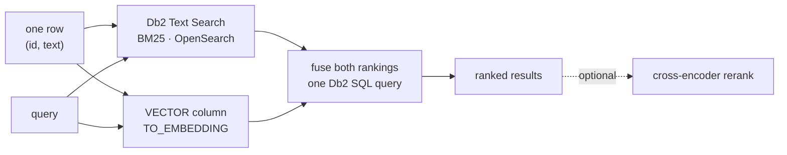

# Hybrid Search

[← Db2 AI Cookbook](../README.md)

> Find the right rows by combining two kinds of retrieval — keyword (BM25) and semantic
> (vector) — and fusing their rankings inside Db2, in a single SQL query.


Most "AI search" demos do half the job, because each retrieval method has a blind spot:

- **Lexical (BM25)** nails exact terms — names, titles, error codes, identifiers — and misses paraphrases.
- **Semantic (vectors)** nails meaning — synonyms, descriptions — and misses exact tokens it can't place. A bare narrator name embeds to noise.

Run both and fuse the results, and each leg covers the other's blind spot. This module does that
with Db2's own AI stack: Db2 Text Search for the lexical index, native `VECTOR` columns plus
in-database `TO_EMBEDDING` for the semantic one.



Where [multimodal embedding](../01-multimodal-embedding/) produces vectors and [RAG](../03-rag/)
answers from what you retrieve, this module is about the retrieval itself — and how to tell
whether it actually got better.

## Recipes

| Recipe | Lexical leg | Semantic leg | Fusion | Extras |
|---|---|---|---|---|
| [sql-fusion-local-models](sql-fusion-local-models/) | Db2 Text Search (BM25), OpenSearch-backed | native `VECTOR` + in-database `TO_EMBEDDING`, local `bge-small-en-v1.5` | gated, score-normalized weighted sum — one SQL query, **not** plain RRF | demo UI · eval harness · optional query-understanding gate and cross-encoder reranker |

## Prerequisites

**Db2 12.1.5**, higher than the 12.1.2 the other modules need — this one uses Db2 Text Search and
in-database `TO_EMBEDDING`, not just the `VECTOR` type. The server install media requires an IBM
entitlement; everything else downloads freely.

Also needed, and covered step by step in the recipe: **OpenSearch 3.7.0** as the Text Search
backend, and a local **llama.cpp** server for the embedding model. CPU-only is fine.

## Quick start

- **[sql-fusion-local-models →](sql-fusion-local-models/README.md#full-setup-on-a-fresh-rhel-box)** — takes a bare Red Hat machine to a running search app in ~30–45 min, mostly downloads.

## Measuring quality

This is the one module where "did it work?" has a number attached. The recipe ships a golden set
of 118 queries with a train/heldout split and an eval harness, so a change to the fusion weights
is something you can measure rather than eyeball. See
[eval-results](sql-fusion-local-models/docs/eval-results.md).

## Module layout

```
02-hybrid-search/
├── sql-fusion-local-models/   # BM25 + vector, fused in SQL · demo UI · eval harness
└── README.md                  # you are here
```
