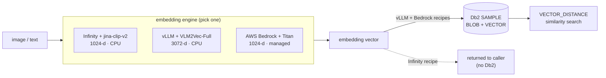

# Multimodal Embedding

[← Db2 AI Cookbook](../README.md)

> A hands-on module for Db2 users: turn images (and text) into vectors with three interchangeable embedding services — two self-hosted on CPU, one managed on AWS — and store the results in a Db2 `VECTOR` column for SQL similarity search.


This module holds three **recipes**. Each is self-contained — its own engine, virtualenv, README, and `.env`. Pick one, follow its Quick start, and you'll go from an image to a stored, queryable embedding. The code is deliberately minimal so the moving parts stay visible.



## Recipes

| Recipe | Engine | Model | Dim | Image input | Db2 storage | Install  | Last checked |
|---|---|---|---|---|---|---|---|
| [infinity-jina-clip-v2](infinity-jina-clip-v2/) | Infinity (torch, CPU) | `jinaai/jina-clip-v2` | 1024 | image **URL** | — | `pip install` (pinned)  | — not checked |
| [vllm-vlm2vec-image-embed](vllm-vlm2vec-image-embed/) | vLLM (CPU) | `TIGER-Lab/VLM2Vec-Full` | 3072 | base64 data URL | `image_embeddings_vlm2vec` | source build¹  | — not checked |
| [bedrock-titan-image-embed](bedrock-titan-image-embed/) | AWS Bedrock (managed) | `amazon.titan-embed-image-v1` | 1024 | raw base64 | `image_embeddings` | `pip install boto3`  | ✅ 2026-07-29 |

¹ This host is AVX2-only with glibc 2.34, so vLLM had no installable CPU wheel and was built from source. On an AVX-512 host with glibc ≥ 2.35, a plain `pip install` works — see that recipe's appendix.

All three place images **and** text in the same vector space, so you can embed a text query and rank images against it.

## Which one should I use?

| If you want… | Use |
|---|---|
| The lightest, fastest local path — ~900 MB model, ~2.5 s warm, embeds image URLs directly | **infinity-jina-clip-v2** |
| A from-scratch vLLM walkthrough — ~8 GB model, base64 images, 3072-d, persisted to Db2 | **vllm-vlm2vec-image-embed** |
| No local model or GPU — a managed API (pay per request), persisted to Db2, runnable from anywhere | **bedrock-titan-image-embed** |

## Quick start

Each recipe has a copy-pasteable Quick start in its own README — start there:

- **[infinity-jina-clip-v2 →](infinity-jina-clip-v2/README.md#quick-start)**
- **[vllm-vlm2vec-image-embed →](vllm-vlm2vec-image-embed/README.md#run-it)**
- **[bedrock-titan-image-embed →](bedrock-titan-image-embed/README.md#quick-start)**

## Storing & searching vectors in Db2

The vLLM and Bedrock recipes persist each result as one row — the original image in a `BLOB`, the embedding in a native Db2 **`VECTOR`** column — so nearest-neighbour search is plain SQL:

```sql
SELECT filename,
       VECTOR_DISTANCE(embedding, (SELECT embedding FROM image_embeddings WHERE id = 1), COSINE) AS distance
FROM image_embeddings
ORDER BY distance
FETCH FIRST 5 ROWS ONLY;
```

`VECTOR` columns are fixed-width, so each model gets its **own table** (1024-d and 3072-d vectors can't share one). Both recipes read their Db2 connection from `.env`: unset `DB2_HOSTNAME` for a passwordless local connection on the Db2 host, or set it (with `DB2_UID`/`DB2_PWD`) to run on a **remote** host over TCP. Requires Db2 **≥ 12.1.2** (where the `VECTOR` type lands) with the `SAMPLE` database.

## Prerequisites

### Db2 (for the storage step)
A Db2 ≥ 12.1.2 instance with the `SAMPLE` database, reachable either locally (run as the instance owner) or over TCP/IP (`DB2COMM=TCPIP`, default port `50000`). The Infinity recipe has no storage step and needs no Db2.

### Fix system SQLite — RHEL 9.6 only, one-time, sudo
On a fresh RHEL 9.6 image, `import sqlite3` is broken system-wide for Python 3.12: the stock `sqlite-libs-3.34.1-9.el9_7` doesn't export `sqlite3_deserialize`, which the `python3.12-libs` (el9_8) `_sqlite3` extension requires. The Infinity recipe imports `sqlite3` at startup and crashes without this fix:

```bash
sudo dnf update -y sqlite-libs        # 3.34.1-9.el9_7 -> 3.34.1-10.el9_8
python3 -c "import sqlite3; print('sqlite3 OK', sqlite3.sqlite_version)"
```

If `dnf update` reports nothing to do, check whether an old SQLite is being injected via `LD_LIBRARY_PATH` (e.g. a Db2 `sqllib/lib64`) ahead of `/lib64`.

## Module layout

```
02-multimodal-embedding/
├── infinity-jina-clip-v2/        # Infinity + jina-clip-v2 (1024-d, CPU, URL input)
├── vllm-vlm2vec-image-embed/     # vLLM + VLM2Vec-Full (3072-d, CPU) → Db2
├── bedrock-titan-image-embed/    # AWS Bedrock Titan (1024-d, managed) → Db2
└── README.md                     # you are here
```
