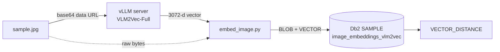

# vLLM VLM2Vec → Db2 vector store

> Embed an image with **VLM2Vec-Full** on a local, CPU-only [vLLM](https://docs.vllm.ai) server, then store the image and its 3072-dim vector in a Db2 `VECTOR` column — ready for SQL similarity search.

-76b900)


A minimal, CPU-only **tutorial** that shows the full stack — from a from-source vLLM build, through an OpenAI-compatible embedding call, to a native Db2 vector row. The client is ~50 lines in [`embed_image.py`](embed_image.py).



> **Tested on:** RHEL 9.6 · Python 3.12 · AMD EPYC-Genoa CPU (AVX-512, no AMX) · no GPU · vLLM 0.22.0 built from source · Db2 **12.1.5** (the `VECTOR` type needs Db2 **≥ 12.1.2**) with the `SAMPLE` database. See [why a source build, and how](#appendix--full-setup-from-scratch).

> **Expect slowness on CPU.** The first request after startup takes ~2–3 minutes (one-time warmup); warm requests are ~20–25 s. Production uses GPUs — this runs on CPU so you can follow along anywhere.

## Run it

> **First time?** This assumes vLLM and the model are already in `.venv`. Starting from scratch? Do the [one-time setup](#appendix--full-setup-from-scratch) first (it builds vLLM and downloads the ~8 GB model), then return here.

```bash
cd vllm-vlm2vec-image-embed
source .venv/bin/activate
./serve.sh                 # launches vLLM in the background; logs -> server.log

# wait until ready (first run downloads ~8 GB + warms up — several minutes)
until [ "$(curl -s -o /dev/null -w '%{http_code}' http://localhost:8000/health)" = "200" ]; do sleep 5; done; echo ready

python embed_image.py
./cleanup.sh               # stop the server when done
```

```
HTTP status: 200
Embedding dimension: 3072
First 10 values: [0.0062263123691082, 0.014218954369425774, 0.024728616699576378, 0.02260902151465416, ...]
Stored sample.jpg + embedding in SAMPLE.image_embeddings_vlm2vec
```

Those 3072 floats are the embedding; the script then writes the image and vector to Db2 — see [Storing the result in Db2](#storing-the-result-in-db2).

> **Prerequisites:** a built `.venv` with vLLM + the model ([appendix](#appendix--full-setup-from-scratch)), and a Db2 ≥ 12.1.2 instance with `SAMPLE` — local or [remote](#running-remotely).

## How it works

Four pieces turn "an HTTP request with an image" into "a stored embedding":

| Component | Role | What it is |
|---|---|---|
| **VLM2Vec-Full** | the model | The trained multimodal embedding model. Open weights from [TIGER-Lab](https://huggingface.co/TIGER-Lab/VLM2Vec-Full), fine-tuned from Microsoft's Phi-3.5-vision. |
| **Transformers** | model loader | Loads the architecture + weights into memory. |
| **PyTorch (CPU)** | runtime | Executes the model's tensor math, here on CPU. |
| **vLLM** | serving engine | Wraps the model in an OpenAI-compatible HTTP server (FastAPI + Uvicorn) — request handling, batching, lifecycle. |

```
HTTP client (embed_image.py)  →  vLLM (FastAPI/Uvicorn)  →  VLM2Vec-Full  →  PyTorch (CPU)
        OpenAI-style JSON              serving engine          the model        the math
```

The client stays simple — read image, build JSON, POST, parse, store — using `requests`, `ibm_db`, and the standard library.

## The API shape

The endpoint is OpenAI-compatible with one twist: OpenAI has **no** image-embeddings endpoint, so vLLM borrowed the `messages` format from OpenAI's *vision chat* API and reused it at `/v1/embeddings`.

**Request**

```json
{
  "model": "TIGER-Lab/VLM2Vec-Full",
  "messages": [{
    "role": "user",
    "content": [
      {"type": "image_url", "image_url": {"url": "data:image/jpeg;base64,/9j/4gIc..."}},
      {"type": "text", "text": "Represent the given image."}
    ]
  }],
  "encoding_format": "float"
}
```

| Field | What it means |
|---|---|
| `messages` | **The vLLM extension** — a chat-style list whose `content` holds the things to embed, replacing OpenAI's text-only `input`. |
| `image_url.url` | The image, inlined as a `data:<mime>;base64,…` URL. The MIME type tells the server how to decode it (that's how non-JPEG formats work). |
| `text` | VLM2Vec's instruction prompt, `"Represent the given image."` |
| `encoding_format` | `"float"` returns the vector as JSON numbers. |

**Response** — `data[0].embedding` holds the 3072 floats:

```json
{ "object": "list",
  "data": [{"object": "embedding", "index": 0, "embedding": [0.0062, 0.0142, ...]}],
  "model": "TIGER-Lab/VLM2Vec-Full", "usage": {…} }
```

## Storing the result in Db2

After printing the vector, the script persists the **image** (`BLOB`) and its **embedding** (native Db2 `VECTOR`) in one row. VLM2Vec is 3072-dim, so this recipe uses its **own table**, separate from the [Bedrock recipe's](../bedrock-titan-image-embed/README.md) 1024-dim `image_embeddings` (a `VECTOR` column is fixed-width — the two can't share a table).

```sql
CREATE TABLE IF NOT EXISTS image_embeddings_vlm2vec (
    id        INTEGER GENERATED ALWAYS AS IDENTITY,
    filename  VARCHAR(255),
    image     BLOB(1M),
    embedding VECTOR(3072, FLOAT32)
);

INSERT INTO image_embeddings_vlm2vec (filename, image, embedding)
VALUES (?, ?, VECTOR(CAST(? AS CLOB(1M)), 3072, FLOAT32));
```

> **Why `CAST(? AS CLOB(1M))`:** a 3072-float JSON string is ~40 KB, which overflows Db2's ~32 KB `VARCHAR` limit. Casting to a `CLOB` lets the full vector through. (The Bedrock recipe's 1024-dim vector is ~13 KB, fits a plain `VARCHAR`, and skips the cast.)

Nearest images to row `1` by cosine distance (0 = identical):

```sql
SELECT filename,
       VECTOR_DISTANCE(embedding, (SELECT embedding FROM image_embeddings_vlm2vec WHERE id = 1), COSINE) AS distance
FROM image_embeddings_vlm2vec
ORDER BY distance
FETCH FIRST 5 ROWS ONLY;
```

### Running remotely

The vLLM server and Db2 don't have to live on the same machine as the script — everything is read from `.env` (copy `.env.example`):

```ini
# If the vLLM server is on another host:
VLLM_URL=http://vllm-host:8000/v1/embeddings

# If Db2 is on another host (presence of DB2_HOSTNAME switches to a remote TCP connection):
DB2_HOSTNAME=db2host.example.com
DB2_PORT=50000            # Db2 SVCENAME port (default 50000)
DB2_UID=db2inst1
DB2_PWD=your-db2-password
```

Both default to `localhost` / local-trusted, so on the Db2 host you can skip `.env` entirely. On the Db2 server, confirm TCP/IP: `db2set DB2COMM` should include `TCPIP`. With `AUTHENTICATION=SERVER` (the default), `DB2_UID`/`DB2_PWD` are the **OS credentials** on the Db2 box.

## Design notes

- **CLOB cast for the vector** — required at 3072-dim (see above); the Bedrock recipe doesn't need it at 1024-dim.
- **BLOB bound as `SQL_BLOB`** — a JPEG has null bytes; a plain-string bind would truncate it. Stored length matches the file byte-for-byte.
- **`.env`-driven connection + URL** — one code path runs locally or remotely, chosen at runtime by `DB2_HOSTNAME` / `VLLM_URL`.
- **Image read once, reused** — base64 for the server, raw bytes for the BLOB. Re-running **appends** a row (no dedupe).

## What's not here

Deliberately omitted: GPU support, auth, TLS, client batching, error handling, retries, upsert/dedupe, an ANN index. To go further:

- Loop over a folder of images, or add a text-query path and rank images against it (shared space)
- Add a vector index for scale, and batch multiple images per request
- Move to a GPU host for usable latency

---

## Appendix — Full setup from scratch

Start here if `.venv` doesn't exist yet. These are the exact steps verified on this VM: **RHEL 9.6, Python 3.12, AMD EPYC-Genoa CPU (AVX-512, no AMX), no GPU.**

> **Why build vLLM from source?** Two host facts force it:
> 1. **glibc 2.34** on RHEL 9.6 is too old for the prebuilt vLLM CPU wheels (they need ≥ 2.35), so vLLM is compiled locally.
> 2. **Genoa has AVX-512 but no AMX**, so the build is pointed at plain AVX-512 — the default build's AMX kernels would crash with *Illegal instruction* on this CPU.

### Prerequisites

A Linux x86_64 host with `sudo`, `git`, and `curl`, plus **Python 3.12** (vLLM 0.22 + torch 2.11 ship `cp312` builds). Check it, installing on RHEL if missing:

```bash
python3.12 --version || sudo dnf install -y python3.12
```

### 1. Clone the repo and enter this recipe

```bash
git clone https://github.com/IBM/db2-ai-cookbook.git
cd db2-ai-cookbook/02-multimodal-embedding/vllm-vlm2vec-image-embed
```

### 2. Create the recipe's virtualenv

```bash
python3.12 -m venv .venv
source .venv/bin/activate
pip install -U pip
```

### 3. Install the system build dependencies

vLLM's x86 CPU backend needs gcc ≥ 12.3 (RHEL ships it as gcc-toolset-13):

```bash
sudo dnf install -y python3.12-devel numactl-devel gcc-toolset-13
```

### 4. Get the vLLM source and its CPU dependencies

```bash
git clone --depth 1 --branch v0.22.0 https://github.com/vllm-project/vllm.git /tmp/vllm-build
cd /tmp/vllm-build
pip install "cmake>=3.26" wheel packaging ninja setuptools-rust setuptools-scm jinja2
pip install -r requirements/cpu.txt --extra-index-url https://download.pytorch.org/whl/cpu
pip install "torchvision==0.26.0+cpu" "torchaudio==2.11.0+cpu" \
  --extra-index-url https://download.pytorch.org/whl/cpu
```

`requirements/cpu.txt` pulls `torch==2.11.0+cpu`.

### 5. Patch the build for AVX-512 without AMX

The default build compiles the importable `_C` module with AMX instructions, which Genoa lacks. Re-point `_C` at plain AVX-512 (vLLM's own `_C_AVX512` recipe):

```bash
sed -i 's#SOURCES ${VLLM_EXT_SRC_AVX512} ${VLLM_EXT_SRC_SGL}#SOURCES ${VLLM_EXT_SRC_AVX512}#' cmake/cpu_extension.cmake
sed -i 's#COMPILE_FLAGS ${CXX_COMPILE_FLAGS_AVX512_AMX}#COMPILE_FLAGS ${CXX_COMPILE_FLAGS_AVX512}#' cmake/cpu_extension.cmake
sed -i '/target_compile_definitions(_C PRIVATE "-DCPU_CAPABILITY_AMXBF16")/d' cmake/cpu_extension.cmake
```

### 6. Compile (~15 min on 16 cores)

```bash
source /opt/rh/gcc-toolset-13/enable
export VLLM_TARGET_DEVICE=cpu CC=$(which gcc) CXX=$(which g++) CMAKE_BUILD_PARALLEL_LEVEL=$(nproc)
pip install . --no-build-isolation
```

### 7. Verify the kernels load

Run this **from the recipe folder, not `/tmp/vllm-build`** — inside the build dir its `vllm/` source subfolder shadows the installed package and you'll get a misleading `ModuleNotFoundError`:

```bash
cd ~/db2-ai-cookbook/02-multimodal-embedding/vllm-vlm2vec-image-embed
python3 -c "import vllm._C; print('vllm._C OK')"
python3 -c "import torch; print(torch.__version__)"     # -> 2.11.0+cpu
```

`vllm._C OK` (no *Illegal instruction*) means the build runs on your CPU.

### 8. Install the client dependencies

```bash
pip install requests ibm_db python-dotenv
```

`requests` calls the vLLM server; `ibm_db` writes the result to Db2; `python-dotenv` loads the server URL and Db2 settings from `.env`. Db2 storage also needs a **Db2 ≥ 12.1.2 instance with the `SAMPLE` database** (the `VECTOR` type lands in 12.1.2) — run on the Db2 host as the instance owner, or [remotely](#running-remotely) with Db2 credentials in `.env`. See [Storing the result in Db2](#storing-the-result-in-db2).

`sample.jpg` ships with the repo. To embed your own image, drop any JPEG/PNG in as `sample.jpg`.

### 9. Run it

The model (~8 GB) downloads from Hugging Face on the first `./serve.sh`. Then follow [Run it](#run-it) above to start the server and embed the image. `/tmp/vllm-build` can be deleted after the build.
