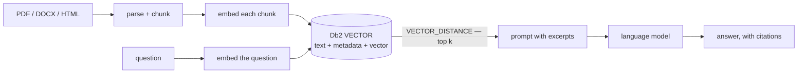

# RAG

[← Db2 AI Cookbook](../README.md)

> Retrieval-augmented generation with Db2 as the vector database: parse a document, store its
> chunks and embeddings in a native `VECTOR` column, retrieve the closest ones with
> `VECTOR_DISTANCE`, and let a language model answer from those excerpts alone.


Where the [multimodal embedding](../01-multimodal-embedding/) module stops at *producing and
storing* a vector, this module closes the loop: retrieve the right vectors for a question, and
ground an answer in them.



## Recipes

| Recipe | Stack | Models | Dim | Db2 storage |
|---|---|---|---|---|
| [db2-haystack-rag](db2-haystack-rag/) | [Haystack](https://haystack.deepset.ai/) pipelines + [Docling](https://github.com/docling-project/docling) parsing | two local models via [llama.cpp](https://github.com/ggml-org/llama.cpp), OpenAI-compatible API | 384 | one table, `VECTOR(384)` |

Everything runs on your own machine — no API keys, no cloud, no per-call cost.

## Prerequisites

**Db2 ≥ 12.1.2.** The native `VECTOR` type and `VECTOR_DISTANCE` were introduced in 12.1.2; on
anything older these recipes cannot work, because the table they create has a `VECTOR` column.
Check with `db2level`.

Each recipe's README covers the rest — model downloads, server setup, and its own `.env`.

## Quick start

- **[db2-haystack-rag →](db2-haystack-rag/README.md#full-setup-on-a-fresh-rhel-box)** — takes a bare Red Hat machine to answered questions, one command at a time.

## Module layout

```
02-rag/
├── db2-haystack-rag/    # Haystack + Docling + local llama.cpp models → Db2 VECTOR
└── README.md            # you are here
```
