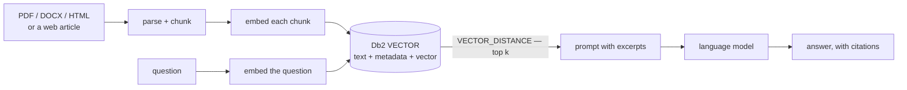

# RAG

[← Db2 AI Cookbook](../README.md)

> Retrieval-augmented generation with Db2 as the vector database: parse a document, store its
> chunks and embeddings in a native `VECTOR` column, retrieve the closest ones with
> `VECTOR_DISTANCE`, and let a language model answer from those excerpts alone.


Where the [multimodal embedding](../01-multimodal-embedding/) module stops at *producing and
storing* a vector, this module closes the loop: retrieve the right vectors for a question, and
ground an answer in them.



## Recipes

| Recipe | Framework | Source document | Chunking | Models | Form |
|---|---|---|---|---|---|
| [haystack-local-models](haystack-local-models/) | [Haystack](https://haystack.deepset.ai/) pipelines | a **PDF**, parsed by [Docling](https://github.com/docling-project/docling) | `HybridChunker`, on section boundaries | via [llama.cpp](https://github.com/ggml-org/llama.cpp), OpenAI-compatible API · 384-d | Python scripts |
| [langchain-local-models](langchain-local-models/) | [LangChain](https://python.langchain.com/) + the `langchain-db2` connector | a **web article**, extracted by [trafilatura](https://trafilatura.readthedocs.io/) | spaCy sentences, 200 words / 50 overlap | Granite 30M + Qwen2.5 3B via `LlamaCpp` · 384-d | Jupyter notebook |

Everything runs on your own machine — no API keys, no cloud, no per-call cost.

### Which one should I use?

| If you want… | Use |
|---|---|
| A command-line walkthrough you can run step by step, over your own PDFs, with a test plan | **haystack-local-models** |
| To read the whole pipeline top to bottom in one notebook — with saved outputs, so it makes sense before you run anything — over web articles | **langchain-local-models** |

They solve the same problem with different tools, so reading both is the fastest way to see which parts of a RAG pipeline are essential and which are framework flavour.

## Prerequisites

**Db2 ≥ 12.1.2.** The native `VECTOR` type and `VECTOR_DISTANCE` were introduced in 12.1.2; on
anything older these recipes cannot work, because the table they create has a `VECTOR` column.
Check with `db2level`.

Each recipe's README covers the rest — model downloads, server setup, and its own `.env`.

## Quick start

- **[haystack-local-models →](haystack-local-models/README.md#full-setup-on-a-fresh-rhel-box)** — takes a bare Red Hat machine to answered questions, one command at a time.
- **[langchain-local-models →](langchain-local-models/README.md)** — download two GGUF models, point `.env` at Db2, open the notebook.

## Module layout

```
03-rag/
├── haystack-local-models/     # Haystack + Docling, PDF in, Python scripts
├── langchain-local-models/    # LangChain + trafilatura, web article in, notebook
└── README.md                  # you are here
```
