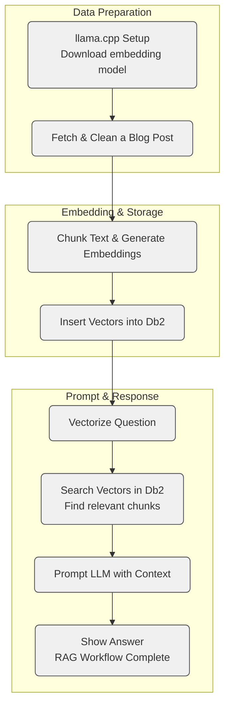

# Build a RAG Pipeline with Db2, llama.cpp, and Watsonx.ai

[← Db2 AI Cookbook](../../README.md) · [← RAG module](../README.md)

This recipe walks through a full Retrieval-Augmented Generation (RAG) pipeline using open components for local embedding generation and a production-grade database, IBM Db2, for vector storage and retrieval.

Two things set it apart from the other RAG recipes: there is **no orchestration framework** — the chunking, embedding, retrieval and prompt assembly are plain Python you can read end to end — and the **answer is generated by a hosted model** on watsonx.ai rather than locally. Embeddings still run on your own machine.

The pipeline combines:

* **Embedding generation** using `llama.cpp` with a local GGUF model
* **Vector search** using IBM Db2’s native `VECTOR` support
* **Answer generation** from a hosted LLM via Watsonx.ai

Most parts of this setup—cleaning source text, chunking, embedding, prompt construction—are implemented in plain Python and designed to be modular. You can adapt this workflow to other vector stores or LLMs by replacing individual components.

---

## What You’ll Learn

* How to run `llama.cpp` for local inference on a CPU-only system
* How to clean and segment raw HTML using sentence-aware chunking
* How to generate embeddings with `llama.cpp` with a text embedding model, such as `granite-embedding-30m`
* How to use Db2’s `VECTOR` type and similarity functions for retrieval
* How to send grounded prompts to a hosted LLM and retrieve responses

---

## RAG Pipeline Overview



---

## Setup Instructions

Clone the cookbook and enter this recipe — every path below is relative to it:

```bash
git clone https://github.com/IBM/db2-ai-cookbook.git
cd db2-ai-cookbook/03-rag/plain-python-watsonx
```

Then run the setup script on a Red Hat Linux (RHEL 9.4) system:

```bash
bash setup.sh
```

The script:

1. Installs system packages (`python3.12`, compilers, curl libraries)
2. Installs [`uv`](https://github.com/astral-sh/uv), a fast Python package manager
3. Creates and activates a virtual environment
4. Installs Python dependencies from `requirements.txt`
5. Installs `llama-cpp-python` via prebuilt CPU wheel
6. Downloads the `granite-embedding-30m` GGUF model

---

## Running the Notebook

To launch the demo:

```bash
source .venv/bin/activate
jupyter notebook rag-db2-demo.ipynb
```

You’ll go through:

1. Loading and cleaning an HTML blog post
2. Chunking content using sentence-based overlap
3. Embedding the text using `llama.cpp`
4. Storing and searching vectors inside Db2
5. Constructing prompts from retrieved chunks
6. Sending prompts to Watsonx.ai for final answers

---

## Environment Configuration

Copy the template and fill it in — the notebook reads `.env` from this recipe's folder:

```bash
cp .env.example .env
```

It holds your watsonx.ai API key and project ID, plus the Db2 connection details. `.env` is
gitignored; never commit it.

> **One thing to watch.** The Db2 Jupyter magic caches these credentials to
> `db2creds.pickle` next to the notebook when you run `%sql CONNECT CREDENTIALS db2creds`.
> That pickle contains your password in plaintext. The cookbook's root `.gitignore` covers
> `*.pickle` for this reason — an ignore rule that names only `.env` will let the copy
> through, which is exactly how such a file reaches a public repo.

---

## Recipe Layout

```
plain-python-watsonx/
├── rag-db2-demo.ipynb        # Full RAG workflow notebook
├── setup.sh                  # llama.cpp + model install script
├── requirements.txt          # Required Python packages
├── .env.example              # Copy to .env and fill in
├── models/                   # GGUF model location (gitignored)
└── README.md
```

The notebook pulls in [`db2.ipynb`](https://github.com/IBM/db2-jupyter) — IBM's Db2 Jupyter
magic extension — with `wget` on first run, so it isn't vendored here.

The other two RAG recipes reach the same destination with a framework doing the work:
[haystack-local-models](../haystack-local-models/) and
[langchain-local-models](../langchain-local-models/). Read one of those next to this one to see
exactly which parts a framework is handling for you.

---

## Notes

* The **embedding model** runs locally via `llama.cpp` with no GPU required
* The **vector store and search** are handled inside IBM Db2 using `VECTOR` type and distance functions
* The **language model** is hosted on Watsonx.ai and called through an API
* All major steps are modular and replaceable

---

## Adaptability

This setup is meant to be transparent and educational. While Db2 is used here for vector search, the rest of the pipeline—embedding, chunking, prompt assembly—is portable and works with other databases or LLMs.

If you're looking to build a grounded, local-first RAG workflow with fine-grained control over every step, this project can serve as a starting point.