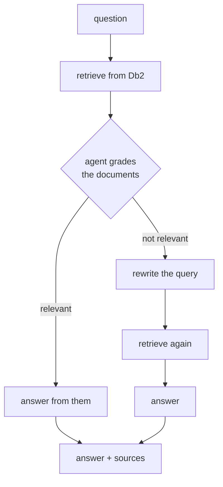

# Agentic RAG

[← Db2 AI Cookbook](../README.md)

> Give the retrieval loop a judgement step. The agent grades what came back, and when the
> documents don't answer the question it rewrites the query and tries again — instead of
> confidently answering from the wrong context.


Plain [RAG](../04-rag/) is a straight line: embed the question, take the top *k* chunks, answer
from them. It has no way to notice that the top *k* were useless — a vague query, an unlucky
embedding, a corpus that doesn't cover the topic — so it answers anyway, from bad context.

Agentic RAG adds a loop:



The same language model that writes the answer also judges whether it *should* — which costs an
extra call or two, and buys a system that degrades honestly instead of hallucinating.

> **What runs where:** embeddings are generated **locally** with
> `granite-embedding-30m-english` via `llama-cpp-python`; the agent's language model is **hosted
> watsonx.ai**, so a `WATSONX_APIKEY` is required. Despite the recipe folder name, this is not a
> fully local stack.

## Recipes

| Recipe | Orchestration | Agent behaviour | Form |
|---|---|---|---|
| [langgraph-local-models](langgraph-local-models/) | [LangGraph](https://langchain-ai.github.io/langgraph/) over the `langchain-db2` connector | grade retrieved docs · rewrite the query · retry against an alternate source · fall back | a notebook prototype **and** the same pipeline split into three FastAPI services behind a gateway |

Embeddings run locally on CPU — `granite-embedding-30m-english` through
[llama.cpp](https://github.com/ggml-org/llama.cpp) — while the agent's reasoning and answers come
from **hosted watsonx.ai** (`mistralai/mistral-large`). You need a `WATSONX_APIKEY`; the
embedding half costs nothing.

## Two lessons in one recipe

The recipe is worth reading in order, because it makes the same pipeline twice:

1. **`prototype/agent.ipynb`** — the whole agent loop in one notebook, top to bottom. This is where you learn what the graph actually does.
2. **`ingestion-api/`, `search-api/`, `gateway-api/`** — that same logic pulled apart into three independently deployable FastAPI services, with a gateway in front.

The second half is the part most RAG tutorials skip: what the notebook has to become before
anything else can call it.

## Prerequisites

**Db2 ≥ 12.1.2** for the `VECTOR` type, plus two GGUF models you download once (~2 GB) and a
`uv`-managed virtualenv per service. The recipe README covers all of it.

## Quick start

- **[langgraph-local-models →](langgraph-local-models/README.md)** — start with the prototype notebook, then bring up the three services.

## Module layout

```
05-agentic-rag/
├── langgraph-local-models/   # LangGraph agent loop: notebook prototype + 3 FastAPI services
└── README.md                 # you are here
```
