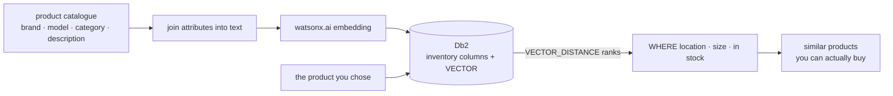

# Recommendation

[← Db2 AI Cookbook](../README.md)

> "Find me something like this one — that I can actually get." Item-to-item recommendation where
> the similarity comes from a vector and the availability comes from a `WHERE` clause, both in the
> same Db2 query.

Where [01-tabular-search](../01-tabular-search/) introduces row similarity on its own, this module
puts it in a retail setting, and the business constraint is the interesting part: a
recommendation nobody can buy is worthless, so store, size and stock filter the results while the
vector ranks them.

## Recipes

| Recipe | Stack | What it shows  | Last checked |
|---|---|---|---|
| [shoe-search-watsonx](shoe-search-watsonx/) | Jupyter + watsonx.ai embeddings | Pick a men's size 12 running shoe in Ottawa, then find the closest match in the Toronto store's inventory — followed by a walkthrough of the vector column, the attribute-to-text step, and the `VECTOR_DISTANCE` query behind it  | ✅ 2026-08-16 |
| [shoe-store-flask-react](shoe-store-flask-react/) | Flask + React 19/Vite, pre-computed vectors | The same 500 shoes behind a storefront: click a product and its "similar products" row comes back from one `VECTOR_DISTANCE` query, inside the page render, with no model call at request time | ✅ 2026-08-16 |

## Prerequisites

Db2 **12.1.2 or later** and Python 3.12. Both recipes ship the same pre-computed vectors, so
neither needs to call watsonx.ai to run — a watsonx.ai API key is only needed to regenerate the
catalogue in [shoe-search-watsonx](shoe-search-watsonx/). [shoe-store-flask-react](shoe-store-flask-react/)
additionally needs Node.js 20+ for its frontend, and no API key at all.

## Where to go next

- [01-tabular-search](../01-tabular-search/) — the same primitive with nothing else around it
- [03-hybrid-search](../03-hybrid-search/) — add keyword matching when the query is words rather than an item
