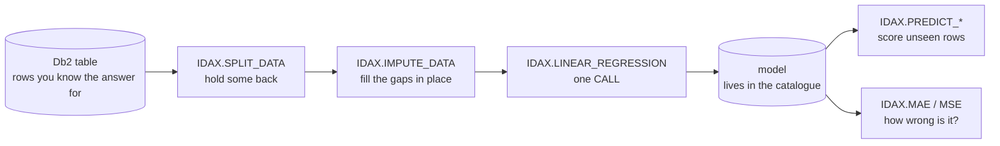

# In-database machine learning

[← Db2 AI Cookbook](../README.md)

> Train a model where the data already is. Db2's IDAX analytic stored procedures split, clean, fit,
> score and measure — every step a `CALL`, nothing exported, no Python in the loop.

Modules 01–06 all answer the same question — *which rows are similar to this one?* — with vectors.
This module answers a different one: *what number should I expect for a row I have never seen?*
That is classical supervised learning, and Db2 does it in SQL.

**This module is a branch, not a next step.** It assumes nothing from 01–06 and nothing from it is
assumed later. Read it when in-database prediction is the thing you need.

## Recipes

| Recipe | Stack | What it shows | Last checked |
|---|---|---|---|
| [gosales-linear-regression](gosales-linear-regression/) | Pure SQL + IDAX, with an optional Flask walkthrough | Predict what a customer will spend from four things you already know about them. Trains on 48,202 customers in under a second, then scores 12,050 it was never shown — typically within $10. Includes a four-screen demo that puts the business story in front of the SQL | ✅ 2026-08-17 |

## Prerequisites

Db2 **12.1** and Python 3.12. No API key and no model download — the training runs entirely inside
Db2.

Unlike every other module in this cookbook, this one needs setup before it will run at all:

- `DB2_ENABLE_ML_PROCEDURES=YES` and an instance restart
- a **16K page-size database** — the 4K default fails later, in ways that do not point at the cause
- `CALL SYSINSTALLOBJECTS('IDAX', 'C', …)` to create the procedures, which are not installed by
  default and have no DDL anywhere in the install tree

The recipe's appendix has the exact sequence. Budget two minutes, and check
`SELECT COUNT(*) FROM SYSCAT.ROUTINES WHERE ROUTINEMODULENAME='IDAX'` returns 737 before going on.

This module also runs against **its own database** rather than `SAMPLE`, because of the page-size
requirement.

## Where to go next

- [01-tabular-search](../01-tabular-search/) — the same "keep it in the database" argument, made with vectors instead
- [06-recommendation](../06-recommendation/) — prediction aimed at products rather than a number
