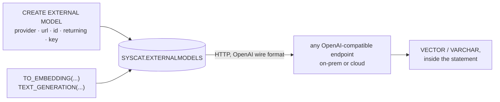

# Language model integration

[← Db2 AI Cookbook](../README.md)

> Call an embedding or text-generation model **from SQL**. Register the endpoint once with
> `CREATE EXTERNAL MODEL`, then `TO_EMBEDDING` and `TEXT_GENERATION` invoke it mid-statement —
> Db2 makes the HTTP call itself.

Every module before this one needs vectors from somewhere, and mostly gets them from Python. This
module is the other route: the model becomes a catalogue object, and inference becomes a scalar
function. `UPDATE DOCS SET embedding = TO_EMBEDDING(doc_text USING M)` embeds a whole table with no
application in the loop — nothing reads rows out, calls a model, and writes vectors back.

`PROVIDER OPENAI` names the OpenAI **wire format**, not the OpenAI service — so a llama.cpp process
on localhost and a hosted API are reached by the same DDL, differing only in URL, model id, vector
width, and whether a key is involved.

This is a **branch** rather than a next step: it assumes nothing from the modules before it. It is
also the mechanism [03-hybrid-search](../03-hybrid-search/) uses for its semantic leg, so it is
worth reading first if that module's `TO_EMBEDDING` calls looked like magic.

## Recipes

| Recipe | Stack | What it shows | Last checked |
|---|---|---|---|
| [sql-local-and-cloud-models](sql-local-and-cloud-models/) | `db2` CLP only — no Python, no framework | `CREATE EXTERNAL MODEL`, `TO_EMBEDDING`, `TEXT_GENERATION` across three `.sql` files, against a local llama.cpp server and Google AI. Includes keeping the API key out of the repo | ✅ 2026-08-27 |

## Prerequisites

Db2 **12.1.5** — `CREATE EXTERNAL MODEL` and the in-database `TO_EMBEDDING` / `TEXT_GENERATION`
functions are not in earlier 12.1.x levels. Check with `db2level`.

Then at least one endpoint speaking the OpenAI wire format: a llama.cpp server on localhost needs
no account and no key, and the cloud half needs a [Google AI Studio](https://aistudio.google.com/apikey)
key. The recipe runs its on-prem script without any credentials at all.

## Where to go next

- [03-hybrid-search](../03-hybrid-search/) — the same `TO_EMBEDDING`, over a real corpus, fused with BM25
- [01-tabular-search](../01-tabular-search/) — what to do with the vectors once a column holds them
- [04-rag](../04-rag/) — retrieval feeding a language model, the Python way
