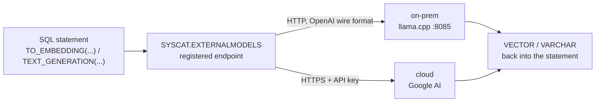

# Calling models from SQL — on-prem and cloud, same two statements

> **Last checked 2026-08-27** — verified: all three scripts end to end against a live llama.cpp
> server and the live Google AI API.  
> Checked on: Db2 12.1.5.0 · RHEL 10 · llama.cpp (`bge-small-en-v1.5` Q8_0) · Google AI
> `gemini-embedding-001` and `gemini-3.5-flash-lite`.

[← Language model integration](../README.md) · [← Db2 AI Cookbook](../../README.md)

> Register an inference endpoint in the Db2 catalogue, then call it from SQL. Three `.sql` files
> and `db2` — no Python, no client library, no application code between the table and the model.


Every other module in this cookbook needs vectors from somewhere. This one is where they come
from when Db2 fetches them itself: `CREATE EXTERNAL MODEL` records an endpoint, and
`TO_EMBEDDING` / `TEXT_GENERATION` call it mid-statement. The same two statements work against a
llama.cpp process on localhost and against a hosted API — the only differences are a URL, a model
id, a vector width, and whether there is a key.



## Quick start

The on-prem script needs no key and no account. Start a llama.cpp embedding server, then:

```bash
llama-server -m bge-small-en-v1.5-q8_0.gguf \
  --embedding --pooling cls --ctx-size 512 --host 127.0.0.1 --port 8085 &

db2 -tvf 1-embed-onprem.sql
```

For the two cloud scripts, get a key from [Google AI Studio](https://aistudio.google.com/apikey)
and supply it **without editing the files** — see [Supplying the API key](#supplying-the-api-key):

```bash
db2 -tvf 2-embed-cloud.sql      # registers the model, then fails on the placeholder key
db2 -v "ALTER EXTERNAL MODEL EMBED_GEMINI SET KEY 'your-key'"
db2 -tvf 2-embed-cloud.sql      # now returns the vector
```

## Expected output

`1-embed-onprem.sql` — a 384-dimension vector from the local model:

```
DIMS        L2_NORM    VECTOR_PREFIX
----------- ---------- ------------------------------------------------------------
        384   0.999999 [-0.0836342573,-0.0671185702,-0.0610774122,-0.0607323162,0.0
```

`2-embed-cloud.sql` — the same prompt, 3072 dimensions from Google:

```
DIMS        VECTOR_PREFIX
----------- -------------------------------------------------------
       3072 [-0.0232301038,-0.017798027,0.00374830514,-0.0676271915
```

`3-generate-cloud.sql` — text rather than a vector, ~2600 characters of it:

```
ANSWER
------------------------------------------------------------------------------
**IBM Db2** is a family of enterprise-grade data management products developed
by IBM. At its core, it is a **Relational Database Management System (RDBMS)**
that is designed to store, analyze, and retrieve data efficiently and securely.
...
```

## Concepts

### Registering an endpoint

```sql
CREATE EXTERNAL MODEL EMBED_LOCAL PROVIDER OPENAI
  ID  'bge-small-en-v1.5'
  URL 'http://127.0.0.1:8085/v1/embeddings'
  TYPE TEXT_EMBEDDING RETURNING VECTOR(384, FLOAT32)
  KEY 'sk-noauth';
```

`PROVIDER OPENAI` names the OpenAI **wire format**, not the OpenAI service. Anything implementing
`POST /v1/embeddings` qualifies, which is why a llama.cpp process on localhost and Google's hosted
API are reached the same way. The registration lands in `SYSCAT.EXTERNALMODELS`; the key does not
appear there.

`RETURNING` must match the model's real output width. Db2 does not discover it, and a wrong number
fails when the model is *called*, not when it is registered.

### Calling it

```sql
SELECT VECTOR_DIMENSION_COUNT(v) AS dims, SUBSTR(VECTOR_SERIALIZE(v), 1, 60) AS vector_prefix
  FROM (VALUES TO_EMBEDDING(CAST('What is IBM Db2?' AS VARCHAR(200)) USING EMBED_LOCAL)) AS t(v);

SELECT TEXT_GENERATION(CAST('What is IBM Db2?' AS VARCHAR(200)) USING GEN_GEMINI) AS answer
  FROM SYSIBM.SYSDUMMY1;
```

Both are ordinary scalar functions, so they compose with everything else in SQL. Swap the literal
for a column and one statement embeds a whole table:

```sql
UPDATE DOCS SET embedding = TO_EMBEDDING(doc_text USING EMBED_LOCAL);
```

That is the payoff of in-database inference: no round trip through an application to read rows,
call a model, and write vectors back. [03-hybrid-search](../../03-hybrid-search/) does exactly this
over a real corpus.

### On-prem vs cloud

| | on-prem (llama.cpp) | cloud (Google AI) |
|---|---|---|
| URL | `http://127.0.0.1:8085/v1/embeddings` | `https://generativelanguage.googleapis.com/v1beta/openai/embeddings` |
| Key | none — `'sk-noauth'` placeholder satisfies the syntax | a real secret |
| Width | 384 (`bge-small-en-v1.5`) | 3072 (`gemini-embedding-001`) |
| Data | never leaves the machine | sent to the provider on every call |
| Cost | CPU time | metered per call, with rate limits |
| TLS | n/a | no keystore or certificate setup needed — Db2's client handles it |

The URL is the **full path**, not just the host. Google's OpenAI-compatible base already contains
its version, so the endpoint is `…/v1beta/openai/embeddings` — *not* `…/v1/embeddings`. Getting
this wrong returns a 404 from the provider, not a Db2 error.

### The three files

| File | Demonstrates | You should see |
| --- | --- | --- |
| `1-embed-onprem.sql` | `CREATE EXTERNAL MODEL` + `TO_EMBEDDING` against localhost | 384 dims, L2 norm ≈ 1.0 |
| `2-embed-cloud.sql` | The same pair against a hosted API with a key | 3072 dims |
| `3-generate-cloud.sql` | `TYPE TEXT_GENERATION` + `TEXT_GENERATION`, returning `VARCHAR` | a paragraph about Db2 |

## Supplying the API key

The two cloud scripts ship with `KEY 'PASTE-YOUR-GOOGLE-AI-STUDIO-API-KEY-HERE'`. **Leave it
there.** The other cookbook recipes keep secrets in a gitignored `.env`, but a `.sql` file run by
the CLP cannot read one, so this recipe uses Db2 itself as the store:

```bash
db2 connect to SAMPLE
db2 -v "ALTER EXTERNAL MODEL EMBED_GEMINI SET KEY 'your-real-key'"
db2 -v "ALTER EXTERNAL MODEL GEN_GEMINI  SET KEY 'your-real-key'"
```

`SET` is required — `ALTER EXTERNAL MODEL … KEY …` is a syntax error. Db2 keeps the key and never
exposes it through `SYSCAT.EXTERNALMODELS`, so after this the key exists nowhere in the working
tree. Run it from a shell whose history you control.

If you would rather edit the files, edit them — but then treat both as secrets, and note that
`db2 -tvf` echoes each statement as it runs, key included. Use `db2 -tf` to suppress the echo.

## Appendix

### Getting the local model

```bash
mkdir -p ~/models/bge-small-en-v1.5 && cd ~/models/bge-small-en-v1.5
curl -LO https://huggingface.co/CompendiumLabs/bge-small-en-v1.5-gguf/resolve/main/bge-small-en-v1.5-q8_0.gguf
```

Any llama.cpp-servable embedding model works — match `RETURNING` to its width.

### Troubleshooting

| Symptom | Cause |
| --- | --- |
| `SQL0204N` on the leading `DROP` | First run, nothing to drop. Expected; the scripts are written to be rerunnable. |
| `SQL20592N … "Please pass a valid API key"` | The placeholder key is still in force. See [Supplying the API key](#supplying-the-api-key). |
| `SQL20592N … "not found for API version v1main"` | The model id is not served on that endpoint. `GET …/v1beta/openai/models` lists what your key can reach. `text-embedding-004` is gone; use `gemini-embedding-001`. |
| `SQL16402N  JSON data is not valid` | **Almost always rate limiting, not a Db2 bug.** Google returns HTTP 429 as a JSON *array* — `[{"error": {"code": 429, …}}]` — and Db2, expecting an object, reports a parse error that never mentions quota. It looks intermittent because quota is consumed per request. Confirm with `curl`, where the real message is readable. `gemini-3.6-flash` allows only **20 requests per day** on the free tier. |
| `SQL0461N … VECTOR(n,FLOAT32) cannot be CAST` | `RETURNING` does not match the model's real width. |
| Nothing fails but nothing is embedded | `CREATE EXTERNAL MODEL` never contacts the endpoint — it succeeds against a dead server, a bad key and a wrong URL alike. The first call is where all of those surface. |

### Cleanup

```sql
DROP EXTERNAL MODEL EMBED_LOCAL;
DROP EXTERNAL MODEL EMBED_GEMINI;
DROP EXTERNAL MODEL GEN_GEMINI;
```
