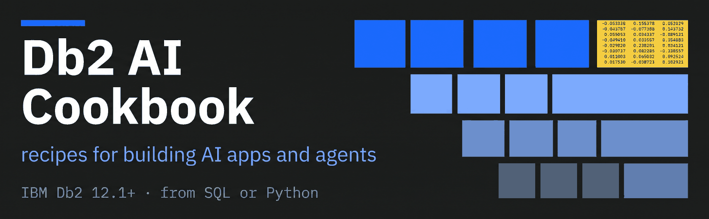

# Db2 AI Cookbook

> Practical, runnable recipes for building AI features on IBM Db2 — embeddings, vector search, and the surrounding plumbing. Every recipe is minimal by design, so the moving parts stay visible.


> **Db2 12.1+.** The exact level each module needs is in the **Needs** column below. Most run on
> **12.1.2**, where the native `VECTOR` type and `VECTOR_DISTANCE` arrive; only
> [03-hybrid-search](03-hybrid-search/) requires **12.1.5**, for Db2 Text Search and in-database
> `TO_EMBEDDING`. Check yours with `db2level`.

The cookbook is organised in two levels:

- A **module** is a topic — one AI capability applied to Db2.
- A **recipe** is one concrete, self-contained way to do it — its own engine, virtualenv, README, and `.env`.

Pick a module, pick a recipe inside it, follow the Quick start.

## Modules

**Not sure where to start?**

- **Shortest path to working code** → [01-tabular-search](01-tabular-search/). Pure SQL, three
  commands, nothing to install.
- **Here for RAG** → [04-rag](04-rag/). It stands alone; you do not need the modules before it.
- **Building search** → [01-tabular-search](01-tabular-search/), then
  [03-hybrid-search](03-hybrid-search/).
- **Reading straight through** → start at 01. Each module assumes only what the earlier ones
  introduced.

| Module | What it covers | Needs | Recipes |
|---|---|---|---|
| [01-tabular-search](01-tabular-search/) | Similarity search over the rows of an ordinary table. Give each row a vector, and `VECTOR_DISTANCE` ranks rows by closeness — while a normal `WHERE` clause filters on ordinary columns in the same statement, which is the part a standalone vector store cannot do. The simplest module in the cookbook: pure SQL, no Python, and on Db2 12.1.2+ the `SAMPLE` database already contains the demo table, so it runs with zero setup. | **Db2 12.1.2+** · SQL only, or Python + watsonx.ai | 2 |
| [02-multimodal-embedding](02-multimodal-embedding/) | Turn images and text into vectors with three interchangeable embedding services — two self-hosted on CPU, one managed on AWS — and store the results in a Db2 `VECTOR` column for SQL similarity search. Both modalities land in the same vector space, so you can embed a text query and rank images against it. | **Db2 12.1.2+** · Python + models (one uses AWS) | 3 |
| [03-hybrid-search](03-hybrid-search/) | Find the right rows by combining keyword search and semantic search. Db2 Text Search gives the BM25 leg, native `VECTOR` columns with in-database `TO_EMBEDDING` give the semantic one, and a single SQL query fuses both rankings so each covers the other's blind spot. Ships a demo UI and a 118-query eval harness, so a change to the fusion is something you can measure. | **Db2 12.1.5** · Python + OpenSearch | 1 |
| [04-rag](04-rag/) | Retrieval-augmented generation over your own documents, with Db2 as the vector database. Chunk a source document, embed and store the chunks, retrieve the closest ones for a question with `VECTOR_DISTANCE`, and have a local language model answer from those excerpts alone. Three recipes solve this different ways — Haystack over a PDF, LangChain over a web article, and one with no framework at all that calls a hosted watsonx.ai model — so you can see which parts of a RAG pipeline are essential and which are framework flavour. | **Db2 12.1.2+** · Python + local models, or watsonx.ai | 4 |
| [05-agentic-rag](05-agentic-rag/) | RAG that checks its own work. A LangGraph agent grades the documents it retrieved, and when they don't answer the question it rewrites the query and retries rather than answering from bad context. Shows the pipeline twice — once as a notebook prototype, then split into three FastAPI microservices behind a gateway, which is the step most RAG tutorials skip. | **Db2 12.1.2+** · Python + local embeddings + watsonx.ai | 1 |
| [06-recommendation](06-recommendation/) | Item-to-item recommendation: "find me something like this one — that I can actually get". Product attributes become a vector, `VECTOR_DISTANCE` ranks the catalogue, and store, size and stock filter it in the same statement — because a recommendation nobody can buy is worthless. | **Db2 12.1.2+** · Python + watsonx.ai | 1 |

More modules are on the way. See [Adding a module](#adding-a-module) below.

## Verification status

Each module's recipe table carries a **Last checked** date, and every recipe README opens with what
was verified and against which environment. The marks mean:

| Mark | Meaning |
|---|---|
| ✅ | Run end to end on the date shown, against a real Db2 and real services |
| ⚠️ | Partially verified — the recipe README says exactly how far it got and why it stopped |
| — | Not exercised in the last pass (usually a missing GPU or a large model download) |

A date is a claim about that day and that environment, not a guarantee. These stacks move: watsonx
retires model IDs, PyPI releases break APIs. If a recipe fails, check its Troubleshooting section
first — several document exactly this class of decay.

## Prerequisites

Recipes that persist vectors need **Db2 12.1.2 or later** — that is where the `VECTOR` type lands — with the `SAMPLE` database, reachable either locally (run as the instance owner) or over TCP/IP (`DB2COMM=TCPIP`, default port `50000`). Recipes that only compute embeddings and hand them back need no Db2 at all.

One module asks for less: [01-tabular-search](01-tabular-search/) is SQL only — no Python, no virtualenv, no models — and its table ships with the `SAMPLE` database on Db2 12.1.2+, so it needs no setup at all.

One module asks for more: [03-hybrid-search](03-hybrid-search/) needs **Db2 12.1.5** plus OpenSearch, because it uses Db2 Text Search and in-database `TO_EMBEDDING` rather than just the `VECTOR` type.

Anything host-specific — OS package fixes, model downloads, build-from-source paths — lives in the relevant module or recipe README, not here.

## Repository layout

```
db2-ai-cookbook/
├── 01-tabular-search/            # similarity over table rows
│   ├── pure-sql/
│   ├── python-watsonx/
│   └── README.md
├── 02-multimodal-embedding/      # images + text → vectors → Db2 VECTOR
│   ├── infinity-jina-clip-v2/
│   ├── vllm-vlm2vec-image-embed/
│   ├── bedrock-titan-image-embed/
│   └── README.md
├── 03-hybrid-search/             # BM25 + vector, fused in one Db2 SQL query
│   ├── sql-fusion-local-models/
│   └── README.md
├── 04-rag/                       # documents → chunks → Db2 VECTOR → grounded answers
│   ├── haystack-local-models/
│   ├── langchain-local-models/
│   ├── plain-python-watsonx/
│   ├── autoai-watsonx/
│   └── README.md
├── 05-agentic-rag/               # RAG that grades its own retrieval and retries
│   ├── langgraph-local-models/
│   └── README.md
├── 06-recommendation/            # similar products, filtered by what's in stock
│   ├── shoe-search-watsonx/
│   └── README.md
├── LICENSE
└── README.md                     # you are here
```

Modules are numbered so they sort in a deliberate reading order; the number is part of the folder name, not a strict sequence you must follow.

## Adding a module

1. Create a numbered folder (`05-…`) with a `README.md` that opens with a one-line description, then lists its recipes in a table.
2. Add a row to the [Modules](#modules) table above.
3. Put each recipe in its own subfolder — one per engine/model combo, with its own `.venv` and **pinned** `requirements.txt`. These stacks bit-rot quickly against current PyPI.

### Naming

Don't repeat what the path already says. A module folder names the **capability** (`rag`, not `db2-rag` — the whole cookbook is Db2). A recipe folder names what makes it *different from its siblings*, which is usually the engine or framework plus the model or how models are served:

```
01-tabular-search/pure-sql                         approach (no framework at all)
01-tabular-search/python-watsonx                   language + model hosting
06-recommendation/shoe-search-watsonx              use case + model hosting
02-multimodal-embedding/infinity-jina-clip-v2      engine + model
03-hybrid-search/sql-fusion-local-models           approach + model hosting
04-rag/haystack-local-models                       framework + model hosting
```

Modules are numbered in reading order — each builds on the one before it. Inserting a module
means renumbering the ones after it, which is cheap and worth doing.

### Recipe README shape

One-line opener → Quick start → expected output → concepts. Host-specific setup and troubleshooting go in an appendix at the end, so the happy path stays short.

### Conventions

- Secrets and host-specific config in a gitignored `.env`; commit a `.env.example` alongside it. Never hardcode credentials.
- Give each recipe that runs a server a distinct port, so several can run side by side.
- Keep the code minimal. A recipe is a teaching artifact, not a library.

## License

[Apache 2.0](LICENSE)
