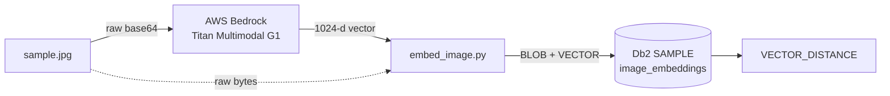

# Bedrock Titan → Db2 vector store

> Embed an image with **Amazon Titan Multimodal G1** on AWS Bedrock, then store the image and its 1024-dim vector in a Db2 `VECTOR` column — ready for SQL similarity search. No GPU, no model download, no server.


This is a minimal, end-to-end **tutorial**: managed inference wired straight into a SQL database that understands vectors. The whole client is ~40 lines in [`embed_image.py`](embed_image.py).



> **Verified on:** RHEL 9.6 · Python 3.12 · `boto3` + `python-dotenv` + `ibm_db` · Db2 **12.1.5** (the `VECTOR` type needs Db2 **≥ 12.1.2**) with the stock `SAMPLE` database. Inference runs in your AWS account (pay per request); storage is local or remote Db2.

## Quick start

```bash
cd bedrock-titan-image-embed
python3.12 -m venv .venv && source .venv/bin/activate
pip install -r requirements.txt          # boto3 · python-dotenv · ibm_db

cp .env.example .env                      # then edit: add your Bedrock API key + region
python embed_image.py
```

```
Embedding dimension: 1024
First 10 values: [-0.0028853526, 0.0013289383, -0.03467212, 0.03582147, -0.0052918084, ...]
Stored sample.jpg + embedding in SAMPLE.image_embeddings
```

One Bedrock call, one Db2 insert. Re-running **appends** another row (the demo doesn't dedupe).

> **Prerequisites:** (1) Bedrock **model access** for *Titan Multimodal Embeddings G1* (console → Model access); without it calls fail with `AccessDeniedException`. (2) A Bedrock **API key** — see [Authentication](#authentication). (3) A Db2 ≥ 12.1.2 instance with `SAMPLE` — local or [remote](#running-remotely-from-the-db2-host).

## Authentication

Bedrock supports a **bearer API key** (GA 2025) — a single token, no SigV4 signing, no access-key/secret pair. Create one in the Bedrock console (**API keys**); the script loads it from `.env` via `python-dotenv`, and `boto3` picks it up automatically:

```ini
# .env  (copied from .env.example — gitignored, never commit it)
AWS_BEARER_TOKEN_BEDROCK=your-bedrock-api-key-here
AWS_REGION=us-east-1
```

A Bedrock API key is scoped to Bedrock + Bedrock Runtime only, so you can't validate it with `aws sts get-caller-identity` — hit Bedrock directly:

```bash
curl -H "Authorization: Bearer $AWS_BEARER_TOKEN_BEDROCK" \
  https://bedrock.us-east-1.amazonaws.com/foundation-models   # HTTP 200 = key works
```

> Standard AWS credentials (`AWS_PROFILE`, access key/secret, or an instance role with `bedrock:InvokeModel`) also work — boto3 falls back to them if no bearer token is set.

## How it works

Two halves, joined by the script:

| Stage | Where | What happens |
|---|---|---|
| **Embed** | AWS Bedrock | The image is sent as raw base64; Titan returns a 1024-d float vector. No model or weights on your host. |
| **Store** | Db2 | The raw image bytes go to a `BLOB` and the vector to a native `VECTOR(1024, FLOAT32)`, in one `INSERT`. |

```
 sample.jpg ──┬─ raw bytes ───────────────────────────────► BLOB(1M)
              └─ base64 ─► Bedrock (Titan) ─► [1024 floats] ─► VECTOR(1024, FLOAT32)
```

The image is read **once** and reused — base64 for Bedrock, raw bytes for the BLOB.

### The Bedrock call

Each Bedrock model defines its own body. Titan's minimal form is just the image:

```json
{ "inputImage": "/9j/4gIcSUND..." }
```

| Field | Notes |
|---|---|
| `inputImage` | The image, **raw** base64 — no `data:image/...;base64,` prefix. |
| `inputText` | *Optional.* Embed text into the **same** space — with the image, or alone as a query vector. |
| `embeddingConfig.outputEmbeddingLength` | *Optional.* `256` / `384` / `1024`. Omitted here, so Titan returns its **1024** default. |

Response: a single embedding (no batch array) — `{ "embedding": [...], "inputTextTokenCount": 0 }`.

### The Db2 data model

```sql
CREATE TABLE IF NOT EXISTS image_embeddings (
    id        INTEGER GENERATED ALWAYS AS IDENTITY,
    filename  VARCHAR(255),
    image     BLOB(1M),                 -- the original image bytes
    embedding VECTOR(1024, FLOAT32)     -- the Titan vector, native Db2 type
);
```

The vector is inserted with Db2's `VECTOR(...)` constructor, which parses a JSON array string — so Python just binds `json.dumps(embedding)`:

```sql
INSERT INTO image_embeddings (filename, image, embedding)
VALUES (?, ?, VECTOR(?, 1024, FLOAT32));
```

## Searching by similarity

Nearest images to row `1` by cosine distance (0 = identical):

```sql
SELECT filename,
       VECTOR_DISTANCE(embedding, (SELECT embedding FROM image_embeddings WHERE id = 1), COSINE) AS distance
FROM image_embeddings
ORDER BY distance
FETCH FIRST 5 ROWS ONLY;
```

Because Titan shares an image/text space, you can also embed a **text** query (`inputText`) and rank images against it — text-to-image search in one `VECTOR_DISTANCE` call.

## Running remotely from the Db2 host

Bedrock is a cloud API, so the only thing tying this module to the Db2 machine is the database connection. To run the script on a **different** host, add Db2 details to `.env` — no code change:

```ini
DB2_HOSTNAME=db2host.example.com   # presence of this switches to a remote TCP connection
DB2_PORT=50000                     # Db2 SVCENAME port (default 50000)
DB2_UID=db2inst1
DB2_PWD=your-db2-password
# DB2_DATABASE=SAMPLE              # optional; defaults to SAMPLE
```

When `DB2_HOSTNAME` is set the script connects over TCP/IP with these credentials; when it's absent it uses a passwordless local trusted connection (run as the instance owner on the Db2 box). On the Db2 server, confirm TCP/IP is reachable:

```bash
db2set DB2COMM                     # should include TCPIP
db2 get dbm cfg | grep SVCENAME    # the listening port (default 50000)
```

> With `AUTHENTICATION=SERVER` (the Db2 default), the remote `DB2_UID`/`DB2_PWD` are the **OS credentials** on the Db2 server. Keep them in `.env`, never in source.

## Design notes

A few non-obvious choices behind the minimal code:

- **Region is read explicitly** — `region_name=os.environ["AWS_REGION"]`. botocore auto-discovers `AWS_DEFAULT_REGION` from the environment but **not** `AWS_REGION`; reading it ourselves keeps the `.env` name standard and fails fast with a clear `KeyError` if it's missing.
- **The BLOB is bound as `SQL_BLOB`.** A JPEG contains null bytes; binding it as a plain string would truncate it. Stored length matches the file byte-for-byte.
- **Db2 connection is `.env`-driven** — one code path, local-trusted or remote-TCP, chosen at runtime by the presence of `DB2_HOSTNAME`.
- **`CREATE TABLE IF NOT EXISTS`** keeps the script idempotent on schema (Db2 ≥ 12.1); rows still accumulate per run.

## What's not here

Deliberately omitted to stay minimal: error handling/retries, request batching, upsert/dedupe, an ANN index, a search CLI. Natural next steps:

- Loop over a folder of images, or add an `inputText` query path for text-to-image search.
- Add a vector index for scale, and `botocore` retries/backoff for production traffic.
- Drop to 256/384-dim (`embeddingConfig`) to trade a little accuracy for cheaper storage.

---

## Appendix — Full setup from scratch

**Requirements:** Python 3.12; an AWS account with Bedrock model access for Titan Multimodal G1; a Db2 ≥ 12.1.2 instance with the `SAMPLE` database — run on the Db2 host as the instance owner, or [remotely](#running-remotely-from-the-db2-host) with Db2 credentials in `.env`.

```bash
# 1. Get the code
git clone https://github.com/shaikhq/multimodal-embeddings.git
cd multimodal-embeddings/bedrock-titan-image-embed

# 2. Install the client (no model download, no compiler, no server)
python3.12 -m venv .venv && source .venv/bin/activate
pip install -U pip
pip install -r requirements.txt

# 3. Configure credentials
cp .env.example .env
#   edit .env: AWS_BEARER_TOKEN_BEDROCK=...  and  AWS_REGION=<region with model access>
#   (optional) DB2_HOSTNAME/DB2_UID/DB2_PWD to run remotely from the Db2 host

# 4. Run it
python embed_image.py
```

`sample.jpg` ships with the repo. To embed your own image, drop any JPEG/PNG in as `sample.jpg`.
